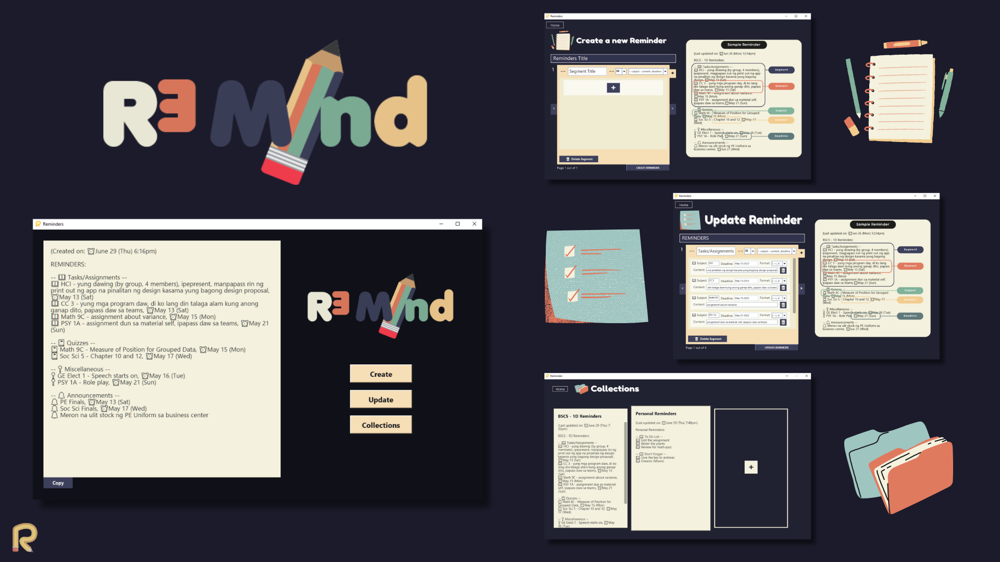
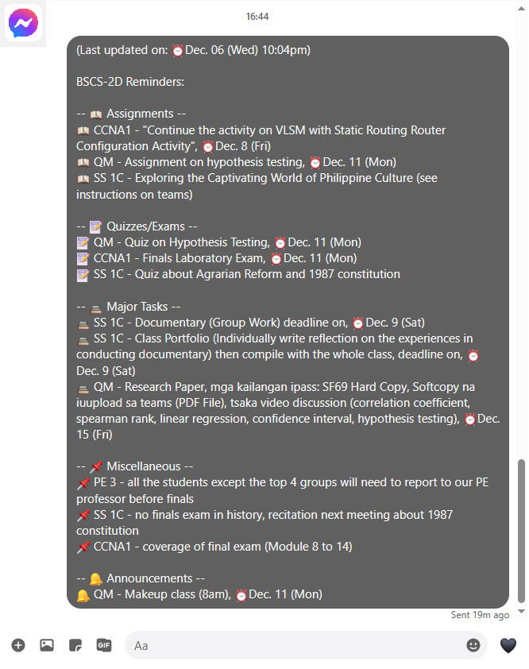
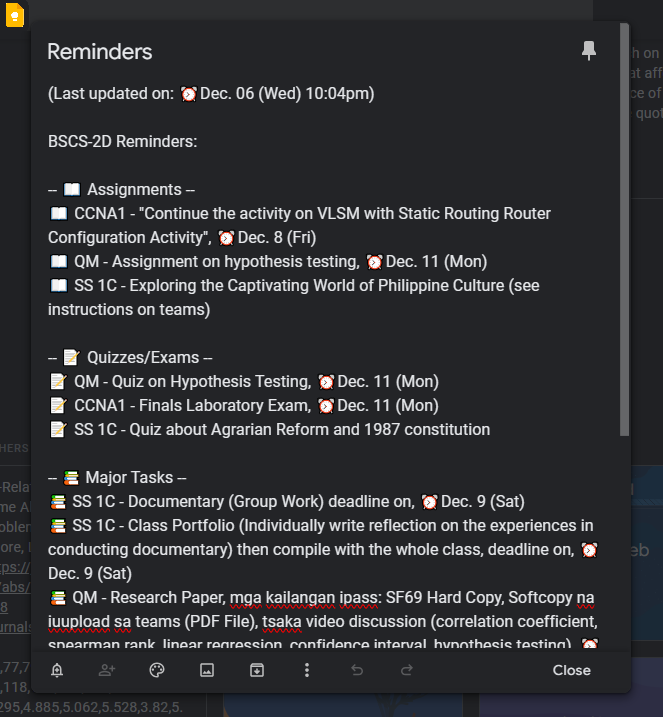
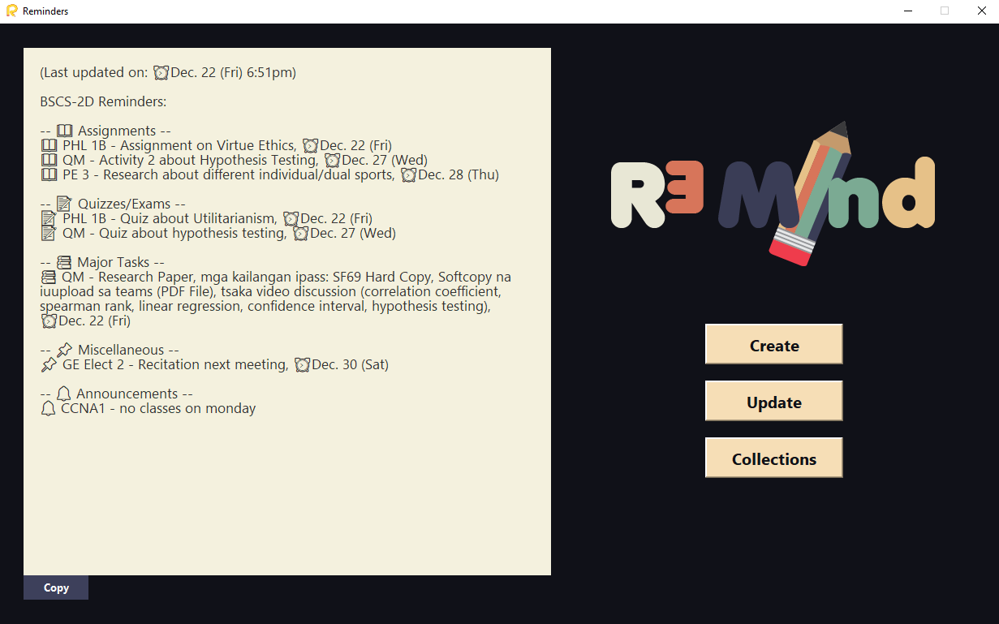
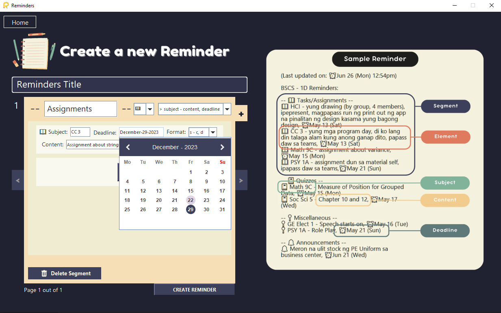
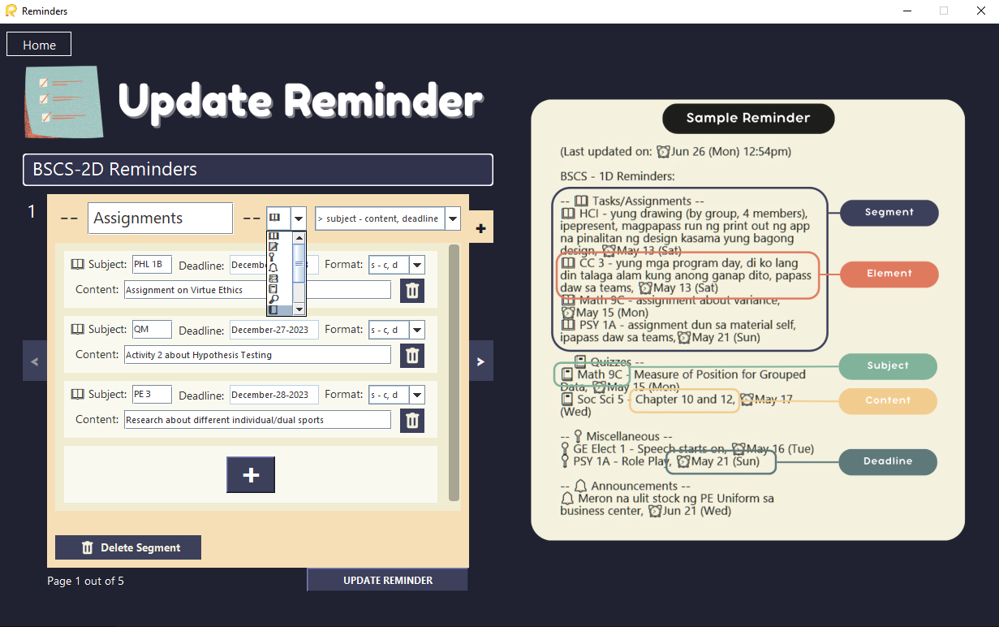
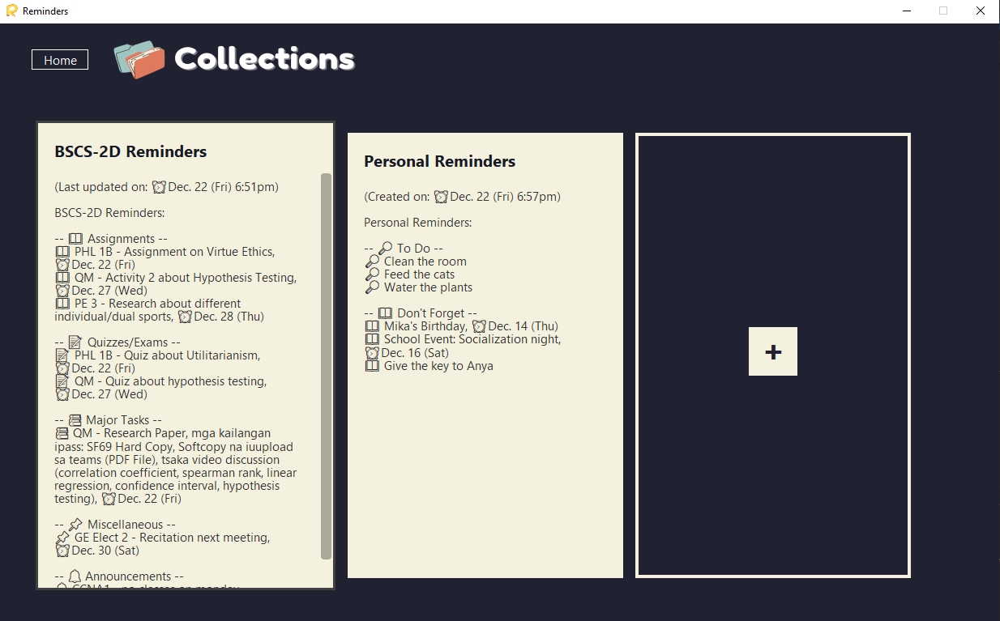

# Reminders Builder 

## A Java Swing Desktop App that helps 'build' and create text reminders with efficiency and maintenance

The app allows users to easily create and update text reminders. It provides a user-friendly guide with predefined text-fields and a format for creating and managing text reminders. Users can then paste these reminders into their notes or any platform where they find it useful for timely reminders.

A sample where an output text reminder might be useful can be seen in the image(s) below:

  
  

## Instructions
### To use the app
* Download and run the [RemindersBuilder_Installer.exe]() file from the "dist" folder to access the app.
* When downloading the file, your browser may display a caution indicating potential harm. As a beginner in deploying software programs, I am still working on making the app more "credible" so that operating systems may not detect it as harmful. In the meantime, simply click "keep anyway" when prompted to download by the browser. Upon running the file, Windows Defender may issue a caution as well; in this case, click "run anyway," and the interface should appear.

#### Troubleshooting
* The program runs with the JRE (Java Runtime Environment), so ensure that you have Java installed on your PC, specifically JRE. The program will look for the runtime environment in your JAVA HOME or PATH folder in environmental variables, so be sure to add the "bin" path of the JRE to those locations.
* If the .exe file fails to open, try downloading the .jar file and run that instead. If the issue persists, attempt troubleshooting by downloading jarfix.exe from the web, enable jarfix, and then attempt to run it again.
* If all else fails, clone the entire repository in your IDE client and try compiling it on your end.

### How to use the App
* When you open the exe file, the app will create a .txt file on the same directory that will serve as the user database file
* The creation of Reminders is straightforward, you can press the create button to create a brand new reminders, fill in all the text fields, choose the format you want, the style of the bullet, the title, etc. and just press the CREATE REMINDER at the bottom. You will be directed The output page, you can now copy and save your reminders. When you press copy the reminders will be copied as text on your clipboard and you can paste it anywhere you want. When you press the save button the created reminders will be saved onto the database and in the collections page where you can see all your created reminders. 
* To update a reminder that you are using, just simply click the UPDATE button and make your desired changes and click the UPDATE REMINDERS button and save your reminders.

## Features still in development
* a need for a time chooser UI (currently, only data chooser is available per bullet item)
* an SQL database (the database currently runs on a .txt file)

## Images

### Home Page

### Create Page

### Update Page

### Collections Page

 &copy; 2024 Aron-Arboleda. All rights reserved.